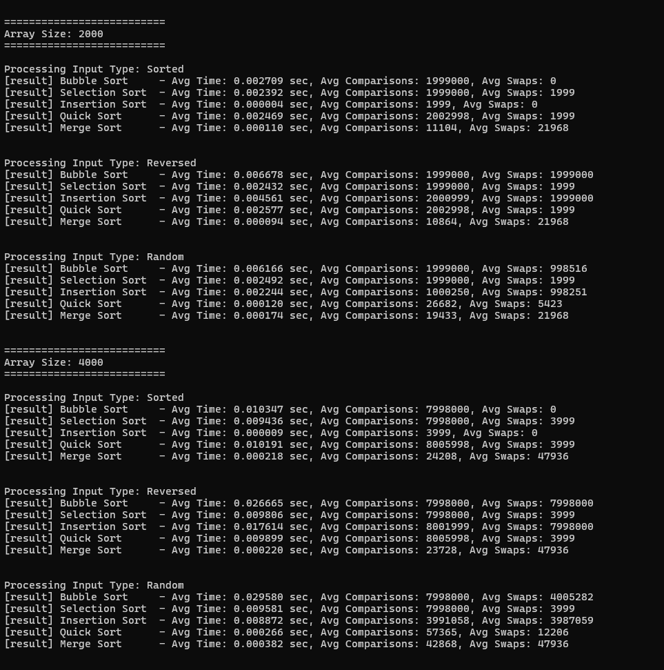

# Sorting Algorithms Performance Analysis

---

## 🏫 **About This Project**

Welcome to the **Sorting Algorithms Performance Analysis** repository! This project was developed to provide an in-depth exploration of popular sorting algorithms, with a focus on analyzing their performance under various conditions. It aims to serve as a learning and benchmarking tool for computer science enthusiasts and students.

---

## 📚 **Objective**

The purpose of this project is to:

✅ Compare different sorting algorithms across diverse input types.  
✅ Implement fundamental sorting techniques in C.  
✅ Measure and analyze the performance of each algorithm in terms of execution time, comparisons, and swaps.  

---

## 💡 **What is Sorting?**

Sorting is a fundamental operation in computer science, where the goal is to arrange the elements of an array or list in a specific order, typically ascending or descending. Sorting is essential in various applications, from searching algorithms to data visualization.

---

## ⚙️ **Algorithms Implemented**

### 1️⃣ **Bubble Sort**
   - Compares adjacent elements and swaps them if they are in the wrong order.  
   - **Time Complexity:**  
     - Best Case: O(n)  
     - Average/Worst Case: O(n^2)  

### 2️⃣ **Selection Sort**
   - Selects the smallest (or largest) element and places it in its correct position.  
   - **Time Complexity:** O(n^2)  

### 3️⃣ **Insertion Sort**
   - Builds the sorted array one element at a time by inserting elements in their correct position.  
   - **Time Complexity:**  
     - Best Case: O(n)  
     - Average/Worst Case: O(n^2)  

### 4️⃣ **Quick Sort**
   - Divides the array into partitions based on a pivot and recursively sorts the partitions.  
   - **Time Complexity:**  
     - Best Case: O(n log n)  
     - Worst Case: O(n^2)  
     - Average Case: O(n log n)  

### 5️⃣ **Merge Sort**
   - Divides the array into halves, recursively sorts them, and then merges them.  
   - **Time Complexity:** O(n log n)  

---

## 🛠️ **Tech Stack**

- **Programming Language:** C  
- **Tools:** GCC for compilation  
- **Development Environment:** Visual Studio Code  

---

## 🚀 **Getting Started**

Follow the instructions below to run the project on your local machine.

### 1. Clone the Repository

```bash
git clone https://github.com/yourusername/SortingAlgorithm.git
cd SortingAlgorithm
```

---

### 2. Compile the Source Code

You can compile the source code using `gcc`. For example:

```bash
gcc sorting_algorithms.c -o sorting_algorithms.exe -Wl,--stack,16777216
```

---

### 3. Run the Program

After compilation, run the executable:

```bash
sorting_algorithms.exe
```

The program will automatically execute all sorting algorithms across predefined array sizes and input types. Results will be saved to `sorting_results.csv`.

---

## 🏆 **Features**

✅ Multiple sorting algorithms: Bubble Sort, Selection Sort, Insertion Sort, Quick Sort, and Merge Sort.  
✅ Performance metrics: Execution time, comparisons, and swaps are measured.  
✅ Diverse input types: Sorted, reversed, and random arrays.  
✅ Results exported to `sorting_results.csv` for further analysis.  

---

## 💬 **Screenshots**



---

## 🙏 **Acknowledgements**

This project would not be possible without the foundational knowledge and inspiration gained from studying **CPE231 - Algorithms** and guidance from my professors and peers at **KMUTT**.

---

📧 **Contact Us:**  
| [Muaykillz](https://github.com/Muaykillz)  
| [NongChugra](https://github.com/NongChugra)  
| [HOOd-00](https://github.com/HOOd-00)  
| [Feen0305](https://github.com/Feen0305)  
| [DarkTouiZ](https://github.com/DarkTouiZ)  

---

